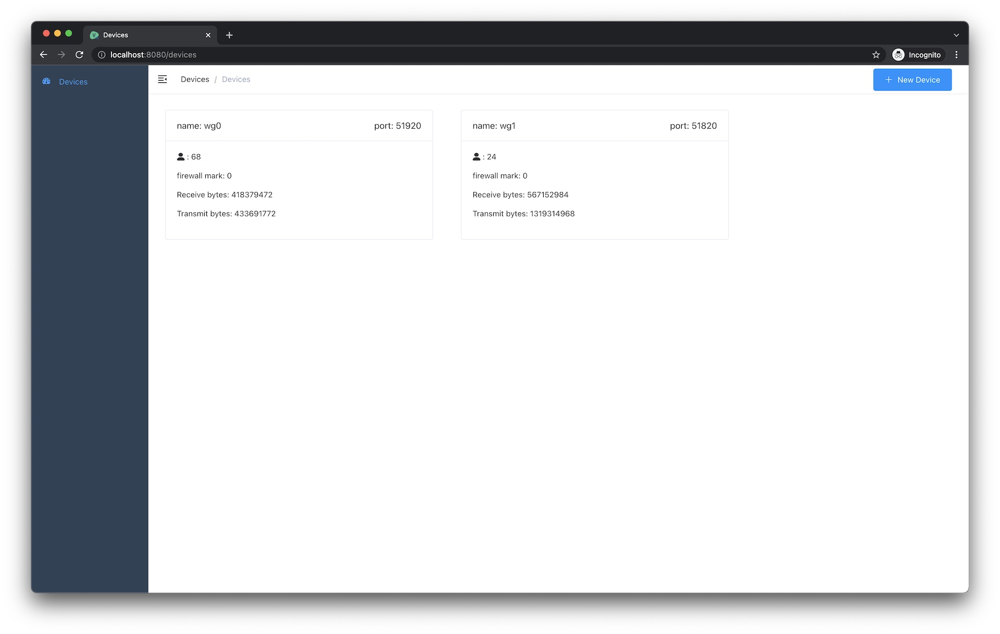
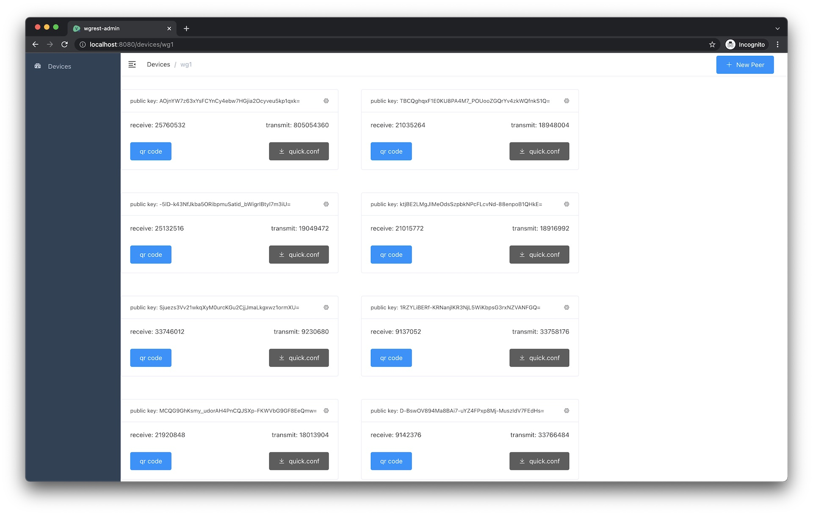
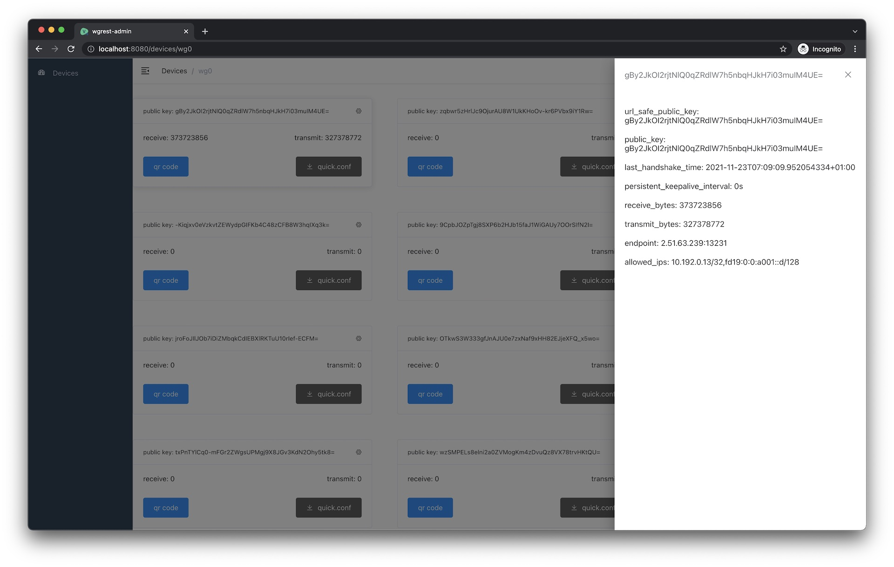
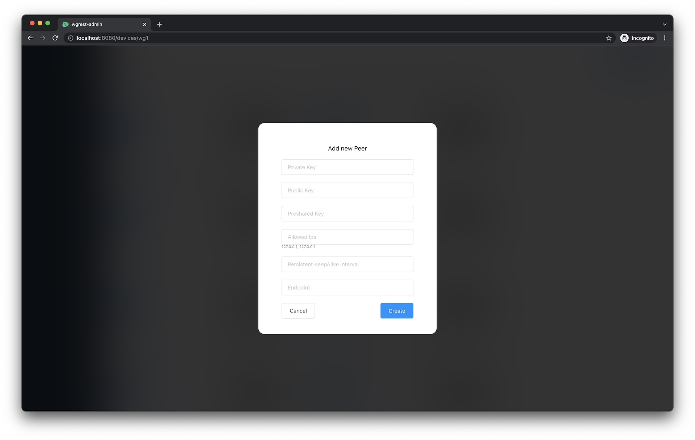

WGRest
---
[](https://drone.fvpn.uk/suquant/wgrest)
[](https://codecov.io/gh/suquant/wgrest)

WGRest is a WireGuard REST API server. It operates wireguard through IPC and doesn't require any dependencies. It aims
to be simpler, faster, and usable on embedded devices such as routers or any other low power and low memory devices.

WireGuard is a simple and modern VPN. It is cross-platform (Windows, macOS, BSD, iOS, Android).

Swagger UI: https://wgrest.forestvpn.com/swagger/

1|2|3|4
:---:|:---:|:---:|:---:
[](examples/screenshots/wgrest-devices-list.jpg) | [](examples/screenshots/wgrest-device-peers-list.jpg) | [](examples/screenshots/wgrest-device-peer-info.jpg) | [](examples/screenshots/wgrest-add-new-peer.jpg)

## Features:

* Manage device: update wireguard interface
* Manage device's peers: create, update, and delete peers
* Peer's QR code, for use in WireGuard & ForestVPN client
* Peers search by query
* Peers sort by: pub_key, receive_bytes, transmit_bytes, total_bytes, last_handshake_time
* ACME TLS support
* Bearer token auth

Check all features [here](https://wgrest.forestvpn.com/swagger/)

## Install

### On Debian / Ubuntu

#### WGRest server

```shell
curl -L https://github.com/suquant/wgrest/releases/latest/download/wgrest_amd64.deb -o wgrest_amd64.deb

dpkg -i wgrest_amd64.deb
```

#### WGRest Web App

```shell
curl -L https://github.com/suquant/wgrest-webapp/releases/latest/download/wgrest-webapp_amd64.deb -o wgrest-webapp_amd64.deb

dpkg -i wgrest-webapp_amd64.deb
```

### Manual

WGRest optionally comes with web ui and it is not included by default into binary. You need to do some extra actions to
enable it.

```shell
curl -L https://github.com/suquant/wgrest/releases/latest/download/wgrest-linux-amd64 -o wgrest

chmod +x wgrest
```

```shell
wgrest -h

NAME:
   wgrest - wgrest - rest api for wireguard

USAGE:
   wgrest [global options] command [command options] [arguments...]

COMMANDS:
   help, h  Shows a list of commands or help for one command

GLOBAL OPTIONS:
   --conf value                wgrest config file path (default: "/etc/wgrest/wgrest.conf") [$WGREST_CONF]
   --version                   Print version and exit (default: false)
   --listen value              Listen address (default: "127.0.0.1:8000") [$WGREST_LISTEN]
   --data-dir value            Data dir (default: "/var/lib/wgrest") [$WGREST_DATA_DIR]
   --static-auth-token value   It is used for bearer token authorization [$WGREST_STATIC_AUTH_TOKEN]
   --tls-domain value          TLS Domains [$WGREST_TLS_DOMAIN]
   --demo                      Demo mode (default: false) [$WGREST_DEMO]
   --device-allowed-ips value  Default device allowed ips. You can overwrite it through api (default: "0.0.0.0/0", "::0/0") [$WGREST_DEVICE_ALLOWED_IPS]
   --device-dns-servers value  Default device DNS servers. You can overwrite it through api (default: "8.8.8.8", "1.1.1.1", "2001:4860:4860::8888", "2606:4700:4700::1111") [$WGREST_DEVICE_DNS_SERVERS]
   --device-host value         Default device host. You can overwrite it through api [$WGREST_DEVICE_HOST]
   --help, -h                  show help (default: false)
```

For Web UI support you need to:

```shell
curl -L https://github.com/suquant/wgrest-webapp/releases/latest/download/webapp.tar.gz -o webapp.tar.gz

sudo mkdir -p /var/lib/wgrest/
sudo chown `whoami` /var/lib/wgrest/
tar -xzvf webapp.tar.gz -C /var/lib/wgrest/
```

After run the server web ui will be available at [http://127.0.0.1:8000/](http://127.0.0.1:8000/)

## Run WireGuard REST API Server

```shell
wgrest --static-auth-token "secret" --listen "127.0.0.1:8000"
```

```shell
Output:

⇨ http server started on 127.0.0.1:8000
```

## Update **wg0** device

```shell
curl -v -g \
    -H "Content-Type: application/json" \
    -H "Authorization: Bearer secret" \
    -X PATCH \
    -d '{
        "listen_port":51820, 
        "private_key": "cLmxIyJx/PGWrQlevBGr2LQNOqmBGYbVfu4XcRO2SEo="
    }' \
    http://127.0.0.1:8000/v1/devices/wg0/
```

```json
{
  "name": "wg0",
  "listen_port": 51820,
  "public_key": "7TvriTzbaXdrsGXI8oMrMoNAWrVCXRUfiEvksOewLyg=",
  "firewall_mark": 0,
  "networks": null,
  "peers_count": 7,
  "total_receive_bytes": 0,
  "total_transmit_bytes": 0
}
```

## Get devices

```shell
curl -v -g \
    -H "Content-Type: application/json" \
    -H "Authorization: Bearer secret" \
    -X GET \
    http://127.0.0.1:8000/v1/devices/
```

```json
[
  {
    "name": "wg0",
    "listen_port": 51820,
    "public_key": "7TvriTzbaXdrsGXI8oMrMoNAWrVCXRUfiEvksOewLyg=",
    "firewall_mark": 0,
    "networks": null,
    "peers_count": 7,
    "total_receive_bytes": 0,
    "total_transmit_bytes": 0
  }
]
```

## Add peer

```shell
curl -v -g \
    -H "Content-Type: application/json" \
    -H "Authorization: Bearer secret" \
    -X POST \
    -d '{
        "allowed_ips": ["10.10.1.2/32"], 
        "preshared_key": "uhFI9c9rInyxqgZfeejte6apHWbewoiy32+Bo34xRFs="
    }' \
    http://127.0.0.1:8000/v1/devices/wg0/peers/
```

```json
{
  "public_key": "zTCuhw7g4Q7YVH6xpCjrz48UJ7qqJBwrXUpuofUTzD8=",
  "url_safe_public_key": "zTCuhw7g4Q7YVH6xpCjrz48UJ7qqJBwrXUpuofUTzD8=",
  "preshared_key": "uhFI9c9rInyxqgZfeejte6apHWbewoiy32+Bo34xRFs=",
  "allowed_ips": [
    "10.10.1.2/32"
  ],
  "last_handshake_time": "0001-01-01T00:00:00Z",
  "persistent_keepalive_interval": "0s",
  "endpoint": "",
  "receive_bytes": 0,
  "transmit_bytes": 0
}
```

## Get peers

```shell
curl -v -g \
    -H "Content-Type: application/json" \
    -H "Authorization: Bearer secret" \
    -X GET \
    http://127.0.0.1:8000/v1/devices/wg0/peers/
```

```json
[
  {
    "public_key": "zTCuhw7g4Q7YVH6xpCjrz48UJ7qqJBwrXUpuofUTzD8=",
    "url_safe_public_key": "zTCuhw7g4Q7YVH6xpCjrz48UJ7qqJBwrXUpuofUTzD8=",
    "preshared_key": "uhFI9c9rInyxqgZfeejte6apHWbewoiy32+Bo34xRFs=",
    "allowed_ips": [
      "10.10.1.2/32"
    ],
    "last_handshake_time": "0001-01-01T00:00:00Z",
    "persistent_keepalive_interval": "0s",
    "endpoint": "",
    "receive_bytes": 0,
    "transmit_bytes": 0
  }
]
```

## Get peer's quick config QR code

```shell
curl -v -g \
    -H "Content-Type: application/json" \
    -H "Authorization: Bearer secret" \
    -X GET \
    http://127.0.0.1:8000/v1/devices/wg0/peers/zTCuhw7g4Q7YVH6xpCjrz48UJ7qqJBwrXUpuofUTzD8=/quick.conf.png?width=256
```


## Delete peer

Since the wireguard public key is the standard base64 encoded string, it is not safe to use in URI schema, is that
reason peer_id contains the same public key of the peer but encoded with URL safe base64 encoder.

peer_id can be retrieved either by `peer_id` field from peer list endpoint or by this rule

```shell
python3 -c "import base64; \
    print(\
        base64.urlsafe_b64encode(\
            base64.b64decode('hQ1yeyFy+bZn/5jpQNNrZ8MTIGaimZxT6LbWAkvmKjA=')\
        ).decode()\
    )"
```

delete peer request

```shell
curl -v -g \
    -H "Content-Type: application/json" \
    -H "Authorization: Bearer secret" \
    -X DELETE \
    http://127.0.0.1:8000/v1/devices/wg0/peers/
```

Credits:

- ForestVPN.com [Free VPN](https://forestvpn.com) for all
- SpaceV.net [VPN for teams](https://spacev.net)
